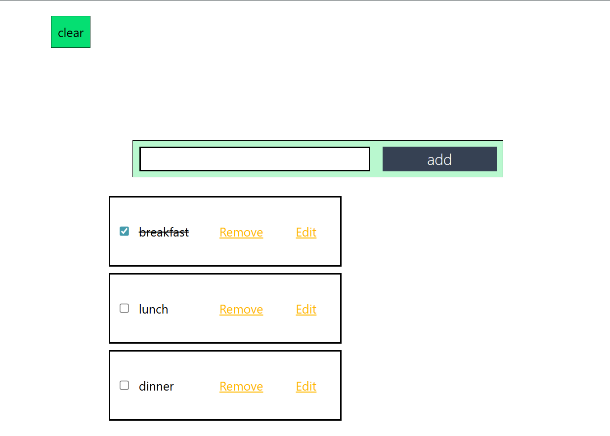
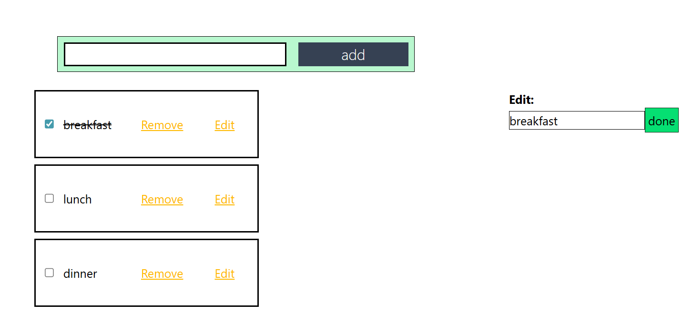

# TODO__LIST ✅

A simple and interactive **To-Do List** app where users can add, edit, remove, and mark tasks as complete. You can also clear all tasks in one click. Built with **React, Redux Toolkit, Tailwind CSS, and Vite**.

---

## 📸 Screenshots

### Main Interface


### Editing the task


---

## 📜 Features

1. ➕ **Add Tasks** — Enter a task and click "Add".
2. 🗑 **Remove Single Task** — Delete individual tasks.
3. ✏ **Edit Task** — Modify existing tasks anytime.
4. ✔ **Mark as Done** — Tick completed tasks (strikethrough style).
5. 🧹 **Clear All Tasks** — Remove all tasks at once with one click.

---

## 🛠 Tech Stack

- **React.js**
- **JavaScript**
- **HTML5**
- **CSS3**
- **Tailwind CSS**
- **Redux Toolkit**
- **Vite**
- **Node.js**

---

## 🚀 Installation

```bash
# 1️⃣ Clone the repository
git clone https://github.com/Abhi00705/TODO_with_new_feature.git

# 2️⃣ Install dependencies
npm install

# 3️⃣ Start the development server
npm run dev
````

---

## 📌 How to Use

1. Type your task in the input bar.
2. Click **Add** to display the task below.
3. **Tick** to mark it as done, or **Edit** to change it.
4. **Remove** a single task or click **Clear** to delete all tasks.

---

## 🤝 Contributing

Feel free to fork this repo, make changes, and create a pull request.

---

## 📄 License

This project is **open-source** and available under the [MIT License](LICENSE).

```

If you want, I can also **add badges (like React, Tailwind, Redux icons)** at the top to make the README look more professional. That would make it stand out more on GitHub.
```
